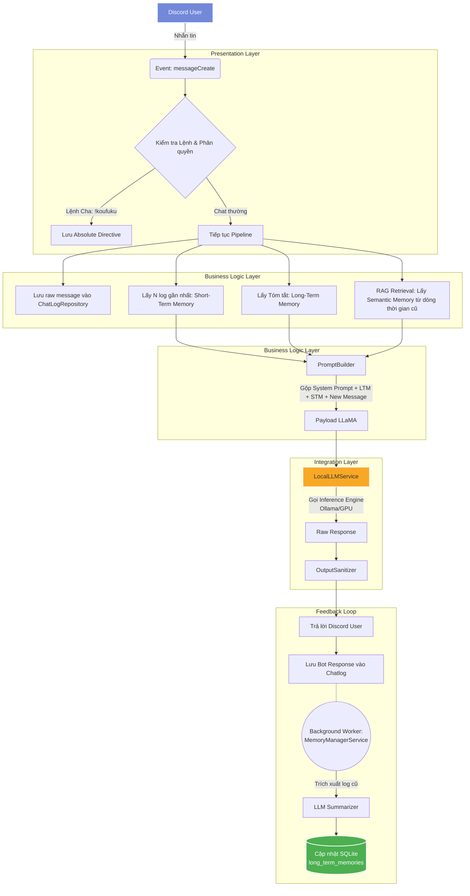

# KoufukuV2 - System Architecture

## 1. Tổng quan hệ thống (System Overview)
Dự án **KoufukuV2** là một AI Chatbot đóng vai nhân vật với thiết kế Persona cụ thể: Takahashi Koufuku (Bán thần khổng tước 15-16 tuổi). Bot tương tác trực tiếp qua Discord, phản hồi theo trí nhớ và ràng buộc tính cách chặt chẽ. Hệ thống sử dụng một Local LLM (qua Groq API / Ollama) để tạo sinh văn bản dựa trên Retrieval-Augmented Generation (RAG) và hệ thống Quản lý Bộ nhớ (Trí nhớ Ngắn hạn & Dài hạn).

**Tech Stack chính:**
- **Ngôn ngữ:** TypeScript / Node.js
- **Nền tảng Tương tác:** Discord.js
- **Database:** SQLite (thông qua `better-sqlite3`)
- **LLM Integration:** Cục bộ thông qua REST API (tương thích `groq-sdk` / `Ollama`)
- **Vector Database (Cognitive):** Lưu trữ dạng file JSON (`memory.json`) và Vector embedding cho Semantic Memory.

---

## 2. Sơ đồ Kiến trúc (Architecture Minimap)

Biểu đồ mô tả luồng dữ liệu (Data Flow) khi nhận một tin nhắn mới từ người dùng trên Discord.



---

## 3. Cấu trúc Thư mục & Modules (Directory Structure)

Dự án áp dụng mô hình phân tách các lớp (Layered Architecture):

```text
src/
├── config/           # Cấu hình môi trường (.env loading, system configs).
├── events/           # Discord event handlers (messageCreate.ts, ready.ts) đóng vai trò là Controller.
├── jobs/             # Các tiến trình chạy ngầm (Cron jobs nếu có).
├── repositories/     # Data Access Layer (DAL) - Chứa logic tương tác trực tiếp với Database.
│   ├── ChatLogRepository.ts   # Xử lý SQLite: Raw logs + Sliding window + LTM queries.
│   ├── MemoryRepository.ts    # Xử lý File IO: Ghi nhận Vector Memory, Directives, User preferences.
├── services/         # Business Logic Layer - Nghiệp vụ cốt lõi.
│   ├── cognitive/             # Xử lý nhận thức.
│   │   ├── EvolutionService.ts      # Bóc tách sự kiện, sở thích từ tin nhắn.
│   │   ├── MemoryManagerService.ts  # Worker tóm tắt trí nhớ dài hạn nền.
│   │   └── VectorMemoryService.ts   # RAG/Semantic memory logic, nhúng embedding.
│   ├── llm/                   # Giao tiếp với Inference models.
│   │   └── LocalLLMService.ts       # Gọi API Local LLM (Ollama) với tối ưu tham số GPU.
│   └── persona/               # Thiết lập nhân vật học.
│       ├── OutputSanitizer.ts       # Lọc, cắt xén token rác, dọn dẹp Response.
│       └── PromptBuilder.ts         # Xây dựng cấu trúc System Prompt khổng lồ.
├── types/            # TypeScript interfaces & types.
└── index.ts          # Entry point khởi tạo bot.
```

---

## 4. Luồng Xử lý Dữ liệu Cốt lõi (Core Workflows)

### 4.1 Quản lý Bộ nhớ lai (Sliding Window & Summarization)
Mục tiêu: Đảm bảo khả năng duy trì ngữ cảnh cho các cuộc hội thoại cực dài mà không vượt quá Token Limit (Lịch sử bị cắt cục bộ).

1. **Short-Term Memory (Cửa sổ Trượt):** Lấy chính xác `N` (ví dụ: N=6) tin nhắn gần nhất từ SQLite để nhồi trực tiếp vào mảng `messages` làm lịch sử hộp thoại tươi sống (Văn phong, Cảm xúc đang tiếp diễn).
2. **Long-Term Memory Retrieval:** Kéo bản tóm tắt duy nhất `summary_content` từ bảng `long_term_memories` và gắn vào `System Prompt`.
3. **Background Summarization (Chạy ngầm):**
   - Sự kiện khởi phát: Không làm chậm (block) luồng xử lý chính. Khi bot đã phản hồi người dùng xong, một `Promise (Fire-and-forget)` được ném đi.
   - `MemoryManagerService.summarizeOldMessages` sẽ kiểm tra số lượng log cũ đã trôi ra KHỎI biên giới Sliding Window (Cũ hơn 6 tin nhắn) và đánh dấu `is_summarized = 0`.
   - Nếu tìm thấy log dư thừa, gọi riêng biệt 1 luồng LLM mới, truyền toàn bộ Log thừa kèm `Bản tóm tắt cũ` (nếu có).
   - Prompt yêu cầu LLM viết lại thành *Một Bản Tóm Tắt Duy Nhất (Cập nhật)*. Trả ngược kết quả vào `long_term_memories` và set `is_summarized = 1` cho các raw log đó.

### 4.2 Cấu trúc Prompt (Prompt Assembly)
`PromptBuilder` đóng gói nội dung theo quy tắc chuỗi khối nghiêm ngặt (Blocks):

1. **Base Personality**: Cốt truyện thần thoại, thông tin về Koufuku.
2. **Addressing Rules**: Đổi xưng hô dựa trên `CreatorId` (gọi "Cha" xưng "Con") hoặc `Người dùng ngoài` (xưng "Em").
3. **Linguistic Constraints**: Các luật ép buồng chữ (vd: Câu trả lời tối đa 2 câu, cấm đảo nghịch quyền lực, không nói tên kiểu robot).
4. **Kill-Switch Directives**: Lệnh từ Đấng sáng tạo ép buộc nhân vật quên RAG mà trả lời theo ý đồ tuyệt đối.
5. **RAG Context**: Ký ức rời rạc (Semantic Memory) lấy từ không gian Vector liên quan tới Input.
6. **LTM Context**: Trí nhớ tổng hợp Long-term memory của hội thoại hiện tại.
7. *(Bên ngoài System)* **Sliding Window + New Message**: Dòng hội thoại thực.

---

## 5. Cấu trúc Database (Data Layer)

Hệ thống sử dụng **SQLite (`better-sqlite3`)** đóng vai trò là Hồ dữ liệu chính (Data Lake) cho lịch sử chat. Các tệp JSON được dùng đan xen cho Vector/Directive data.

### Cấu trúc bảng (SQLite `full_chatlog.sqlite`):
#### Bảng `raw_chatlogs`
Lưu trữ toàn bộ tin nhắn chat thô chưa qua chỉnh sửa. Đóng vai trò là Input cho Sliding Window.

| Column          | Type     | Description                                                     |
|-----------------|----------|-----------------------------------------------------------------|
| `id`            | INTEGER  | Primary Key (Auto Increment).                                   |
| `session_id`    | TEXT     | Discord Channel ID hoặc User ID định nghĩa phiên chat.        |
| `role`          | TEXT     | `user` hoặc `assistant` hoặc `system`.                          |
| `content`       | TEXT     | Nội dung tin nhắn.                                              |
| `timestamp`     | DATETIME | Thời gian sinh tin nhắn. Default: `CURRENT_TIMESTAMP`.          |
| `is_summarized` | BOOLEAN  | Bằng `1` nếu tin nhắn đã bị trừu tượng hóa vào Long-term memory. |

#### Bảng `long_term_memories`
Bảng đơn ánh. Mỗi Session chỉ có duy nhất 1 Row chứa bản tóm tắt diễn biến tối thượng.

| Column            | Type     | Description                                                     |
|-------------------|----------|-----------------------------------------------------------------|
| `session_id`      | TEXT     | Primary Key.                                                    |
| `summary_content` | TEXT     | Chuỗi văn bản tóm tắt từ Hệ thống ngầm (ví dụ: "Người dùng đang phàn nàn..."). |
| `updated_at`      | DATETIME | Lần cuối cùng Background Worker cập nhật row này.               |
